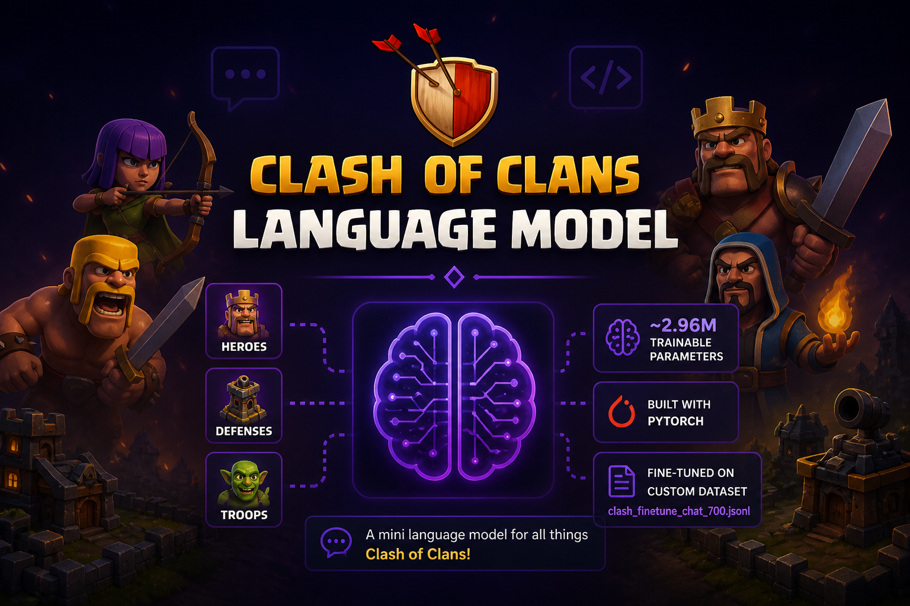

<p
  align="center">
   
</p>

<div align="center">
  <h3>Clash of Clans Mini Language Model  </h3>
</div>

<div align="center">
  
[](https://www.python.org/downloads/)
[](https://github.com/YUGESHKARAN/Clash_of_Clans_Language_Model/issues)
[](https://github.com/YUGESHKARAN/Clash_of_Clans_Language_Model/pulls)
[](https://opensource.org/licenses/MIT)
[](https://github.com/YUGESHKARAN/Clash_of_Clans_Language_Model/stargazers)
[](https://github.com/YUGESHKARAN/Clash_of_Clans_Language_Model/network)


</div>

A mini language model built from scratch using **PyTorch**, fine-tuned on a supervised custom Clash of Clans dataset (`clash_finetune_chat_700.jsonl`).  
The model contains **~2.96 million** trainable parameters and is designed for NLP tasks related to Clash of Clans heroes, defenses, and troops.

---

## Highlights

- **From-Scratch Implementation:** PyTorch-based, no external LLM dependencies.
- **Custom Dataset:** Fine-tuned on Clash of Clans-specific data.
- **Jupyter Notebooks:** Easy exploration and experimentation.
- **Lightweight:** Trained with ~2.96M learnable parameters.

## Prerequisites

- Python **3.8+**
- Jupyter Notebook (optional - If willing to train by your own system)
- or load this pretrained weights
- (Recommended) `virtualenv` or `conda` for environment management

## Project Structure

```plaintext
Clash_of_Clans_Language_Model/
├── clash_finetune_chat_700.jsonl      # Custom supervised dataset
├── index.py                           # Model code (training and inference)
├── requirements.txt                   # Python dependencies
├──language_model_class.py             # model architecture and hyperparameters
├──clash_transformer_finetuned.pth     # model pretrained weights
├──tokenizer.pkl                       # pre-saved tokenizer map (dictionary)
└── README.md                          # Project documentation
```

## Model Hyperparameters

- `batch_size`: 64
- `block_size`: 256
- `n_embed`: 256
- `n_heads`: 8
- `n_layer`: 6
- `learning_rate`: 1e-4
- `max_iters`: 3000
- `eval_interval`: 100


## Installation

1. **Clone the repository:**
   ```bash
   git clone https://github.com/YUGESHKARAN/Clash_of_Clans_Language_Model.git
   cd Clash_of_Clans_Language_Model
   ```

2. **Install dependencies:**
   ```bash
   pip install -r requirements.txt
   # Or, for conda users:
   # conda env create -f environment.yml
   ```
3. **Run Command**
   ```bash
   python index.py
   ```

4. **Server running at:** http://localhost:5000 (Default)
5. **Request Data Format**
   ```json
   {
      "prompt":"Can you tell me (variation 1) about the Barbarian King."
      }
   ```
6. **Response Data Format**
   ```json
   {
     "prompt": "Can you tell me (variation 1) about the Barbarian King.",
     "response": "The Barbarian is the first troop unlocked in the game. It takes 1 housing space, has moderate hitpoints, and deals melee damage. At max level, it has          230 hitpoints, deals 54 damage, and takes 1 housing space.<"
   }
   ```

## Contributing

Contributions are welcome! Please open issues or pull requests for suggestions, bug fixes, or improvements.

## License

This project is licensed under the MIT License. See the [LICENSE](LICENSE) file for details.

## Acknowledgements

- **Supercell** – for Clash of Clans inspiration
- The open-source ML & NLP communities
- Special thanks to **Andrej Karpathy** for his [GPT-2 reproduction lecture](https://www.youtube.com/watch?v=kCc8FmEb1nY)

---

> _This project is not affiliated with or endorsed by Supercell. For educational and research purposes only._
